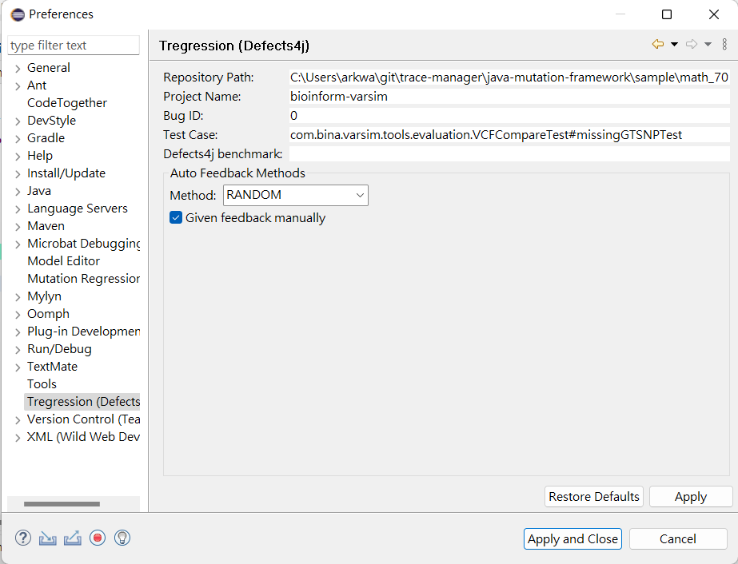

# TRregression (ERASE)
TRregression (Trace-Based Regression ) aims to analyze execution trace to find regression bug.

A demo video is here.

Audience can also check https://youtu.be/Mte08XIETlU to apply autonamous debugging with Tregression.

# Citation
If you need to reference our technique, please use the following citations:

- Haijun Wang#, Yun Lin#*, Zijiang Yang, Jun Sun, Yang Liu, Jin Song Dong, Qinghua Zhen, and Ting Liu. Explaining Regressions via Alignment Slicing and Mending, Transcation on Software Engineering (TSE 2019). (#co-first author, *corrsponding author)

# Source Code Configuration
## Dependency
The TRegression (i.e., ERASE) project relies on Microbat project to collect execution Trace of Java program. When you are importing tregression project, you need to important Microbat project (https://github.com/llmhyy/microbat) as well. Note that all the projects are Eclipse plugin project. The imported projects are listed as follows:
- microbat (mirobat)
- microbat_instrumentator (mirobat)
- microbat_junit_test (mirobat)
- mutation (mirobat)
- sav.commons (mirobat)
- tregression (tregression)

Moreover, this prototype are build on top of Defects4J bugs. We forked Defects4J repository (https://github.com/llmhyy/defects4j) and please checkout the buggy version and fixed version by our script. (https://github.com/llmhyy/defects4j/blob/master/checkout.sh). If you run the script successfully, you can checkout the bug file structure as follows:
bug_repo

|__ Chart (project_id) 
&nbsp;&nbsp;&nbsp;&nbsp;&nbsp;&nbsp;|__ 1 (bug_id) 
&nbsp;&nbsp;&nbsp;&nbsp;&nbsp;&nbsp;|__ 2     
&nbsp;&nbsp;&nbsp;&nbsp;&nbsp;&nbsp;|__ ... 
  
Last, please unzip this file (https://github.com/llmhyy/tregression/blob/master/tregression/dependent_lib/junit_lib.rar) under the dropins directory of your eclipse root folder. It contains all the runtime Java libraries.

## Running Tregression (ERASE) on Defects4J bugs
After import the projects, right-click the tregression project, and choose "Run As Eclipse Application", you can start debugging Tregression. You need to configure the settings in the Eclipse-application as follows:

Second, please switch to Tregression perspective by (Windows >> Perspectives >> Open Operspective >> Other). 

Third, click "Tregression" menu >> Run for Seperate Versions. The tool will automate the regression bug detection.

## Running Mutation on Tregression

Tregression now are able to mutate a originally correct trace into buggy trace that fail on targeted test case

To perform the mutation functionality, please follow the steps:

1. Install `Java Mutation Framework`

    1. Git clone the [Java Mutation Framework](https://github.com/llmhyy/java-mutation-framework.git).

    2. Inside the `Java Mutation Framework`, run `./scripts/setup.bat`

    You may also check the `readme` in `java-mutation-framework` for more information

2. There are several setting that you need to change. In the toolbar, go to `Window -> Preference -> Tregression (defect4j)`
   

   
   
 

   - **Repository Path:** It is the absolute path to the testing project. The recommanded testing project are installed within `java-mutation-framework/sample`. In this example, we are using `math_70` as our testing project: `C:\Users\user_name\git\java-mutation-framework\sample\math_70`
   - **Bug ID:** It represent which test case that is being tested. For example, for `Bug ID = 0`, that mean the first test case is being tested. Make sure that the `Bug ID` does not exceed the number of test cases. In our example, we are testing the first test case so that the input is `0`.
   - **Give feedback manually:** Check this box if you want to give the feedback manually, which is also the recommanded choice. 
    
      If the box is unchecked, then tregression will give the feedback by comparing the buggy trace and correct trace. However, since some of the variable are changed for running the baseline, it is possible that tregression may give wrong feedback.

3. It is assumed that [Microbat]() is installed. In the toolbar, go to Window -> Preference -> Microbat Debugging. Set up the following parameters:

      

   
   

   - **Java Home Path:** Absolute path to `JAVA 8`
   - **Step Limit:** Reasonable step limit. 300000 is recommended.

4. Click the `Read Cross` button. It will perform the mutation.
   

   
   

5. At the end of the mutation, the input and the ouput variables will be automatically detected, which can be used for the belief propagation section.

## Run Belief Propagation on Tregression

Tregression can now debug based on belief propagation technique. For more information about debuggin on belief propagation, please refer to the paper `Debugging with Intelligence via Probabilistic Inference`.

1. It is assumed that [Microbat](https://github.com/llmhyy/microbat.git) is installed

2. Please open `microbat\microbat\BP_Server\BP_Server.ipynb` using jupyter notebook

3. Run every cell in `BP_Server.ipynb`

4. If you are testing belief propagation with mutation framework, after the mutation is done, Tregression will print out the automatically detected input and output variables. If the variable are correctly detected, please skip step 5.

5. Define the input and the output variables:

    - **Define Inputs Variables**
      1. Navigate to the node that define the input variables. Note that there may be multiple node that define input variables.
      2. In the `Step Property View`, select the input varaibles and click `Inputs` button.
      

      
      

   - **Define Outputs Variables**

     1. Navigate to the node that define the output variables.
     2. In the `Step Property View`, select teh output variables and click `Outputs` button

   - **Check Selected IO**

      1. In the `Step Property View`, click the `IO` button. It will print the information of selected inputs and outputs variable in the console
   - **Clear Selected IO**

      1. If you select a wrong input or output, you need to click the `Clear` button in `Step Property View` to erase all the selected inputs and outputs, then select them again.

6. Click the `Green Go Back` button to perform belief propergation wait for the result.

    

        
    

7. If the recommanded node is not the root cause, the program will for feedback. You will need to give the feedback manually if you click the `manual feedback` box in the `Tregrssion Preference`.
   - **Give feedback CORRECT**
      1. In `Step Porperty View`, check the `correct` button and click the `Feedback` button to submit the feedback.
      

      
      

   - **Give feedback WRONG PATH**
     1. In `Step Porperty View`, check the `control` button and click the `Feedback` button to submit the feedback.
      

      
      

   - **Give feedback WRONG VARIABLE**
     1. In `Step Porperty View`, check the `data` button
     2. Select all the variable that you think is wrong
     3. Click the `Feedback` button to submit the feedback.
      

      
      

8. Repeat the step 7 until the root cause is found. Or, after giving 20 feedbacks, the program will stop and claim that root cause cannot be found. Plase note the it takes time to wait for belief propagation to converge. 